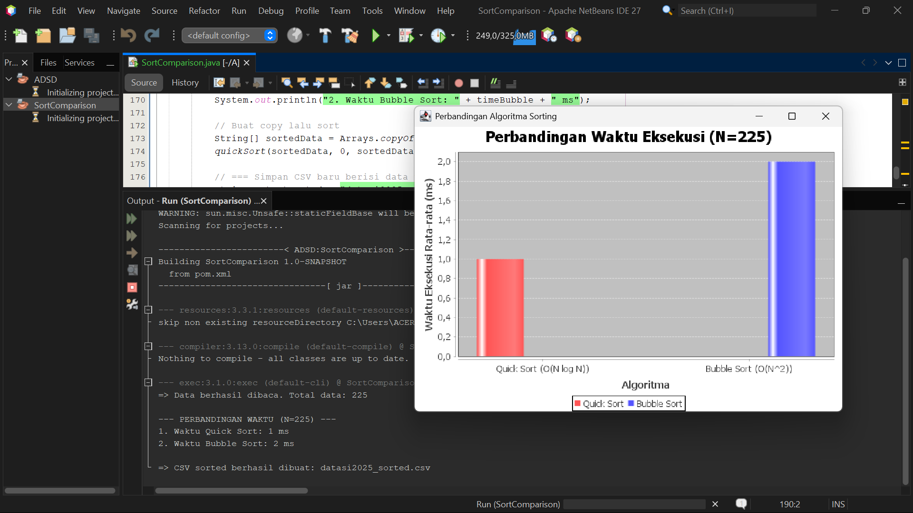

# Sorting Algorithm Benchmark & Visualizer
A Java-based performance benchmarking tool designed to analyze, compare, and visualize the execution efficiency of sorting algorithms (Quick Sort vs. Bubble Sort) using real-world CSV dataset.

1. Fitur Utama
- Algorithm Comparison: Evaluates time complexity differences ($O(n \log n)$ vs $O(n^2)$).
- Data Visualization: Integrates JFreeChart to render execution runtime charts clearly.
- Dataset Processing: Reads and sorts structured data directly from CSV files.
- Maven Architecture: Clean dependency management and build lifecycle.

2. Tech Stack
- Language: Java
- Build Tool: Apache Maven
- Visualization: JFreeChart

3. Cara menjalankan proyek
a. Clone this repository:
   ```bash
   git clone [https://github.com/nashwaisn-ux/sort-comparison-benchmark.git]
b. Open the project in your preferred IDE (NetBeans / IntelliJ / VS Code).
c. Build the project using Maven:
   "mvn clean compile"
d. Run SortComparison.java.

4. Visual Benchmark

